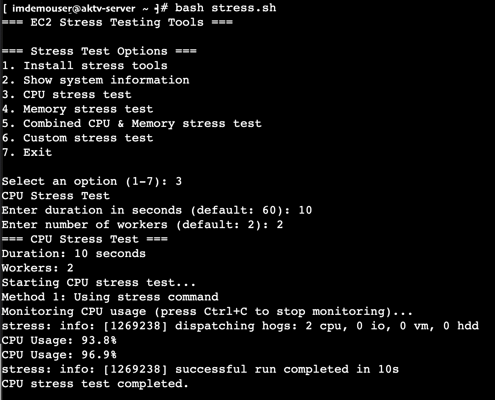

# Linux CPU and Memory Stress Testing Script

This script provides an interactive, menu-driven way to perform CPU, memory, and combined stress tests on any Linux server. It uses the popular `stress` tool to simulate high load and helps you monitor system resource usage in real time.

## Features

- **Install stress tools**: Installs `stress`, `stress-ng`, and `htop` for load testing and monitoring.
- **Show system information**: Displays CPU cores, total/available memory, and load average.
- **CPU stress test**: Runs a CPU load test for a configurable duration and number of workers.
- **Memory stress test**: Allocates and stresses a configurable amount of memory for a set duration.
- **Combined CPU & Memory stress test**: Simultaneously stresses CPU and memory.
- **Custom stress test**: Lets you configure duration, CPU workers, and memory allocation.
- **Resource monitoring**: Shows CPU and memory usage during tests.

## Prerequisites

- A Linux server (tested on Ubuntu, Debian, Amazon Linux, CentOS, RHEL).
- Root or sudo privileges to install packages.

## Usage

### 1. Download the Script

Copy the script file [`linux-stress-test.sh`](linux-stress-test.sh) to your Linux server.

### 2. Make the Script Executable

```sh
chmod +x linux-stress-test.sh
```

### 3. Run the Script

```sh
./linux-stress-test.sh
```

### 4. Follow the Interactive Menu

You will see a menu like:

```
=== Stress Test Options ===
1. Install stress tools
2. Show system information
3. CPU stress test
4. Memory stress test
5. Combined CPU & Memory stress test
6. Custom stress test
7. Exit
```

- **Option 1**: Installs required tools (`stress`, `stress-ng`, `htop`).
- **Option 2**: Displays system info.
- **Option 3**: Prompts for duration and CPU workers, then runs a CPU stress test.
- **Option 4**: Prompts for duration and memory size, then runs a memory stress test.
- **Option 5**: Prompts for duration, then runs a combined test with default CPU/memory.
- **Option 6**: Lets you set duration, CPU workers, and memory allocation.
- **Option 7**: Exits the script.




### 5. Monitoring

During tests, the script will display CPU and/or memory usage every 5 seconds. Press `Ctrl+C` to stop monitoring if needed.

## Example

To run a CPU stress test for 120 seconds with 4 workers:

1. Select option 3.
2. Enter `120` for duration.
3. Enter `4` for number of workers.

## Notes

- The script automatically detects your package manager (`yum` or `apt`) and installs tools as needed.
- For best results, run as root or with sudo privileges.
- Use with caution on production systems.

## License

This script is provided as-is, without warranty. Use at your own risk.

---

**Author:**  
[linux-stress-test.sh](linux-stress-test.sh)